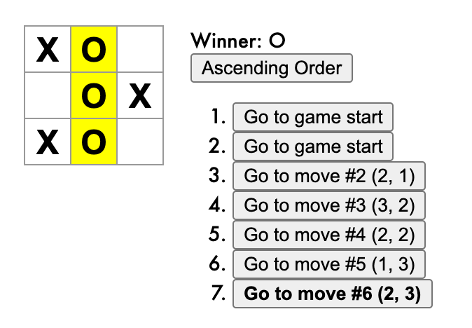
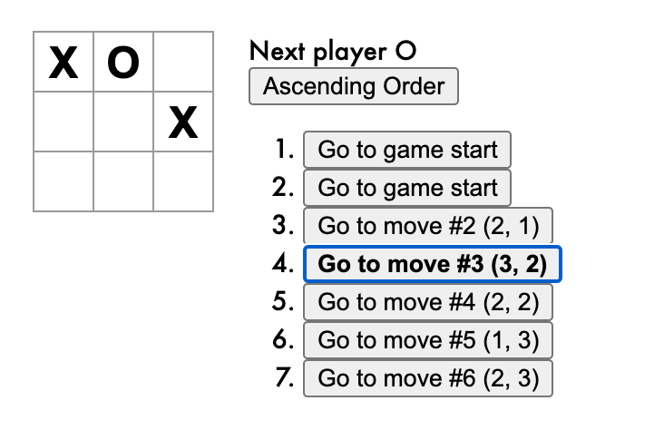

# React Tic-Tac-Toe

Solution to the [React Tic-Tac-Toe tutorial](https://reactjs.org/tutorial/tutorial.html) with the suggested improvements implemented. The project has also been rewritten to TypeScript from JavaScript.

The aim of this project was to introduce myself to React and TypeScript.

## Screenshots

|  |  |
|-------------------------------|---------------------------------|

## Build Instructions

Make sure you have [npm](https://www.npmjs.com/) and [yarn](https://www.npmjs.com/package/yarn) installed.

To run for development:

```bash
yarn start
```

Then access [http://localhost:3000/](http://localhost:3000/).
